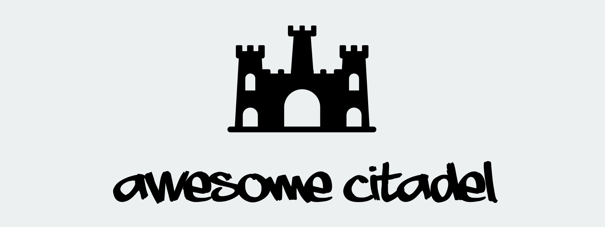

This is a collection of resources to help people reject subservience and adopt sovereignty.

PRs welcome. Please see CONTRIBUTING.md for guidelines.

**THIS DOCUMENT IS A WORK-IN-PROGRESS. If you're seeing this message, you were probably invited early for your field of expertise. Please suggest updates so this page can become a robust go-to resource for everyone.**

- [Technology](#technology)
  - [Software](#software)
  - [Hardware](#hardware)
- [Finance](#finance)
- [Defense](#defense)
- [Real Estate](#real-estate)
- [Citizenship](#citizenship)
- [Energy](#energy)
- [Education](#education)
- [Law](#law)
- [Food](#food)
- [Healthcare](#healthcare)
- [Transportation](#transportation)
- [Events](#events)
- [Further Perspective](#further-perspective)
  - [People](#people)
  - [Books](#books)
  - [Videos](#videos)
  - [Articles](#articles)
  - [Podcasts](#podcasts)

## Technology

_Adopt open-source technology that shifts power from big-tech to individuals._

_Focus here is on tools & technologies that enable critical function in extreme scenarios. For more thorough coverage of technology alternatives, see [awesome-selfhosted](https://github.com/awesome-selfhosted/awesome-selfhosted) and [Privacy Guides](https://privacyguides.org/)._

### Software

_Mobile Software_

- [GrapheneOS](https://grapheneos.org/) - privacy & security focused mobile OS based on Android with no proprietary Google software
- [Calyx OS](https://grapheneos.org/) - privacy-focused mobile OS based on Android with no proprietary Google software
- [F-Droid](https://f-droid.org/) - app store exclusively for free/libre open-source apps 

_Desktop Software_

- [Pop!_OS](https://pop.system76.com/) - refined Linux OS for power-users maintained by System76
- [Elementary OS](https://elementary.io/) - Linux OS that looks and feels like macOS
- [Linux Mint](https://linuxmint.com/) - Linux OS that looks and feels like Windows

_Communication_

- [Signal](https://signal.org/) - centralized, convenient, private messaging
- [Silence](https://silence.im/) - encrypted SMS and MMS messaging sent over cellular networks
- [Matrix](https://matrix.org/) - federated, self-hostable instant messaging protocol
- [Manyverse](https://www.manyver.se/) - peer-to-peer social networking on mobile; no servers or internet required
- [Briar](https://briarproject.org/) - peer-to-peer chat for Android that runs on the Tor network
- [StoneAge Messenger](https://cweb.gitlab.io/StoneAge.html) - peer-to-peer chat where user devices host application logic and cloud storage persists encrypted user data
- [Jitsi](https://jitsi.org/) - self-hostable video chat software that requires no accounts and no software
- [Fediverse](https://github.com/topics/activitypub) - various self-hostable social networks
    - Popular implementations include [Mastodon](https://joinmastodon.org/), [Pleroma](https://pleroma.social/), [PeerTube](https://joinpeertube.org/), [Lemmy](https://join-lemmy.org/), and [Pixelfed](https://pixelfed.org/)    

### Hardware

- [System76](https://system76.com) - computers built to run Linux out-of-the-box with zero configuration
- [GoTenna](https://gotenna.com/) - proprietary devices that can be wirelessly daisy-chained to create a mesh network anywhere on Earth

**[`^        back to top        ^`](#)**

## Finance

_Tools to hold value and conduct commerce without gatekeepers._

- [Bitcoin](https://bitcoincore.org) - peer-to-peer magic internet money that enables you to be your own bank
- [Bisq](https://bisq.network) - peer-to-peer software that enables you to be your own exchange
- [BTCPay Server](https://btcpayserver.org/) - self-hosted payment processor that allows you to sell goods with no middleman
- [LNURLPoS](https://github.com/arcbtc/LNURLPoS) - cheap, offline, hardware device that accepts Lightning payments

_Resources_

- [Bitcoin Only](https://bitcoin-only.com/) [website]
- [The Bitcoin Standard](https://www.goodreads.com/book/show/36448501-the-bitcoin-standard) [book]

**[`^        back to top        ^`](#)**

## Defense

_Protect yourself, your family, and your assets._

- [DEFCAD](https://defcad.com/) - repository for technical data on 3D-printable firearms
- [Deterrence Dispensed](https://chat.deterrencedispensed.com/) - community for 3D2A
- [GUNS.TEAM](https://joe-rodgers.github.io/guns.team/) - collection of links and resources for 3D2A

_Resources_

- [Plastic Defense](https://www.popularfront.co/3D) - documentary about 3D-printed firearms in Europe and the decentralised network behind them [video documentary]

**[`^        back to top        ^`](#)**

## Real Estate

_The physical basis of all human life: find good land and put it to good use._

- [Decentralized Grazing](https://untappedgrowth.com/decentralizedgrazing/) - decentralized land regeneration network

_Resources_

- [How to Build a Small Town in Texas](https://wrathofgnon.substack.com/p/how-to-build-a-small-town-in-texas) [article]

**[`^        back to top        ^`](#)**

## Citizenship

_Move to a place in the world that is better-suited for you._

- [Plan B Passport](https://planbpassport.com/) - acquire another passport for a country with more favorable conditions
- [Nomad Capitalist](https://nomadcapitalist.com/) - strategy and advice on citizenship and wealth planning

**[`^        back to top        ^`](#)**

## Energy

_Generate energy off the grid._

**[`^        back to top        ^`](#)**

## Education

_Get your kids (and yourself) away from mass propaganda camps._

- [The Ron Paul Curriculum](https://www.ronpaulcurriculum.com/) - a K-12 homeschool curriculum focused on liberty and self-discipline

**[`^        back to top        ^`](#)**

## Law

_Legal concepts for sovereignty-minded communities._

- [Free Private Cities Foundation](https://www.freeprivatecities.com/)
- [Bürgerliches Gesetzbuch](https://en.wikipedia.org/wiki/B%C3%BCrgerliches_Gesetzbuch) - aka German BGB, civil code adopted in some form by many countries

_Resources_

- [Free Private Cities: Making Governments Compete for You](https://www.goodreads.com/book/show/41123024-free-private-cities) [book]
- [SLP161 Titus Gebel – Bitcoin Citadels as Free Private Cities](https://stephanlivera.com/episode/161/) [podcast episode]
- [TFTC #267: Free private cities, economic zones, and gradual progress with Rahim Taghizadegan](https://anchor.fm/tales-from-the-crypt/episodes/267-Free-private-cities--economic-zones--and-gradual-progress-with-Rahim-Taghizadegan-e16m214) [podcast episode]
- [Legal Systems Very Different From Ours](https://www.goodreads.com/book/show/30066446-legal-systems-very-different-from-ours) [book]

**[`^        back to top        ^`](#)**

## Food

_Source your food from more local sources, possibly even from your own land._

- [Texas Beef Initiative](https://inititive.substack.com/p/texas-beef-initiative-is-your-heritage) - high-quality protein mining in Texas

_Resources_

- [Dirt: The Erosion of Civilizations](https://www.goodreads.com/book/show/587916.Dirt) [book]

**[`^        back to top        ^`](#)**

## Healthcare

_Get higher-quality medical care by avoiding large, dubious, broken systems._

- [Direct primary care](https://en.wikipedia.org/wiki/Direct_primary_care) - cash-based primary care that aims for higher-quality care by avoiding insurance companies
- [CrowdHealth](https://www.joincrowdhealth.com/) - fund unexpected healthcare costs through the cash savings of a crowd instead of an insurance company

**[`^        back to top        ^`](#)**

## Transportation

_Move around the world more freely._

**[`^        back to top        ^`](#)**

## Events

_Immerse yourself in communities that have uncompromising perspectives on sovereignty and how to achieve it._

- [Hackers Congress](https://hcpp.cz/) - annual event in Prague focused on cryptoanarchy and the future it enables
- [Guns N' Bitcoin](https://gunsnbitcoin.com/) - annual event focused on the uncompromised sovereignty enabled by guns and bitcoin

## Further Perspective

_Resources for the general concepts of citadel theory, sovereignty, and freedom._

### People

- [UntappedGrowth](https://twitter.com/untappedgrowth/) - navigating 🤡🌎 via homesteading and land regeneration
- [Marketsbylili](https://twitter.com/marketsbylili/) - sovereignty through bitcoin mining and private/secure technology
- [Wrath of Gnon](https://twitter.com/wrathofgnon/) - principles of sustainable, wholesome urban design and architecture

### Books

- [The Sovereign Individual](https://www.goodreads.com/book/show/82256.The_Sovereign_Individual)

### Videos

- [Citadel Theory: What is coming and How to Survive It](https://untappedgrowth.com/citadel-theory-what-is-coming-and-how-to-survive-it/) - talk by UntappedGrowth at _Market Disruptor_ (2021)

### Articles

### Podcasts

**[`^        back to top        ^`](#)**
